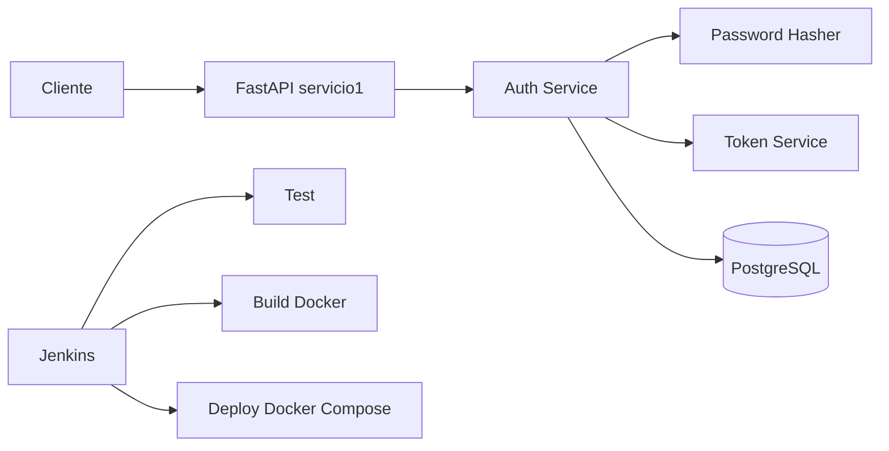

## Context

El estado actual de servicio1 es una implementación mínima sin separación clara de capas de autenticación ni persistencia en PostgreSQL para credenciales y perfil de usuario. El proyecto exige un flujo demostrable de CI/CD local con Docker y Jenkins, por lo que el diseño debe priorizar simplicidad, reproducibilidad y trazabilidad de pruebas.

Stakeholders: equipo académico del proyecto, mantenedores del repositorio y evaluadores de integración continua.

## Goals / Non-Goals

**Goals:**

- Implementar autenticación básica en servicio1 con endpoints estables para registrar usuario, iniciar sesión, obtener perfil autenticado y consultar usuario por id.
- Emitir token de acceso en login y validar token en endpoints protegidos como /auth/me.
- Persistir usuarios en PostgreSQL usando variables de entorno para conexión y configuración.
- Garantizar pruebas mínimas automatizadas que validen salud del servicio y flujos principales de autenticación.
- Estandarizar Test, Build y Deploy local mediante Jenkins y Docker Compose.

**Non-Goals:**

- Implementar OAuth2 completo, refresh tokens o federación de identidad.
- Diseñar autorización granular avanzada basada en políticas complejas.
- Cubrir despliegues cloud o estrategias multi-entorno fuera del contexto local/CI académico.

## Decisions

1. Arquitectura modular en servicio1 (api, services, models, schemas, db).
Rationale: reduce acoplamiento y facilita pruebas unitarias por componente.
Alternativas consideradas:
- Mantener single-file app: descartado por baja mantenibilidad.
- Micro-módulos adicionales por feature: descartado por complejidad innecesaria.

2. Hash de contraseñas con biblioteca estable de password hashing.
Rationale: proteger credenciales sin almacenar texto plano.
Alternativas consideradas:
- Almacenar password sin hash: descartado por inseguro.
- Esquema criptográfico custom: descartado por riesgo y costo de mantenimiento.

3. SQLAlchemy + PostgreSQL como persistencia principal.
Rationale: coherencia con stack del curso y facilidad de pruebas de integración.
Alternativas consideradas:
- SQLite en producción local: descartado por desalineación con requisito explícito de PostgreSQL.
- ORM alternativo: descartado para minimizar cambios.

4. Configuración por variables de entorno con valores por defecto seguros para local.
Rationale: portabilidad entre entorno de desarrollo, Docker y Jenkins.
Alternativas consideradas:
- Configuración hardcoded: descartado por baja seguridad y poca portabilidad.

5. Pipeline Jenkins declarativo con etapas explícitas checkout, install, test, build, deploy.
Rationale: alineación con guía del repositorio y claridad de evaluación.
Alternativas consideradas:
- Pipeline scripted: descartado por menor legibilidad en este alcance.

6. Token firmado con expiración para autenticación stateless (Bearer token).
Rationale: permite proteger endpoints sin mantener estado de sesión en servidor y facilita validación en entornos Docker/CI.
Alternativas consideradas:
- Sesiones en memoria: descartado por baja escalabilidad y complejidad en contenedores.
- API keys estáticas: descartado por menor seguridad y trazabilidad por usuario.

## Risks / Trade-offs

- [Desalineación entre entornos local y CI] -> Mitigación: usar mismas variables y comandos de Compose en Jenkins.
- [Flakiness por dependencia de base de datos en tests] -> Mitigación: unit tests aislados y fixtures deterministas.
- [Cobertura limitada por alcance mínimo de pruebas] -> Mitigación: priorizar escenarios críticos de autenticación y salud.
- [Complejidad de credenciales en CI] -> Mitigación: inyectar variables de entorno en Jenkins y evitar secretos en código.
- [Token inválido o expirado en clientes] -> Mitigación: respuestas 401 consistentes y pruebas para token ausente/inválido/expirado.

## Migration Plan

1. Refactor incremental de servicio1 hacia estructura modular, manteniendo endpoint de health operable.
2. Añadir modelos/esquemas de usuario y capa de autenticación con hash de contraseñas.
3. Implementar emisión y validación de token en login y endpoints protegidos.
4. Configurar conexión PostgreSQL por entorno y actualizar Dockerfile/Compose.
5. Incorporar tests unitarios mínimos y validar ejecución en local, incluyendo validación de token.
6. Crear/actualizar Jenkinsfile con etapas checkout/install/test/build/deploy.
7. Validar pipeline completo en Jenkins local.

Rollback:

- Revertir cambio a la versión previa de servicio1 si fallan etapas críticas.
- Mantener imagen Docker previa etiquetada para retorno rápido en entorno local.

## Open Questions

- ¿La etapa deploy de Jenkins debe ejecutar servicio1 únicamente o todo docker-compose del proyecto?
- ¿Se requiere política mínima de contraseñas (longitud/complejidad) en esta iteración?